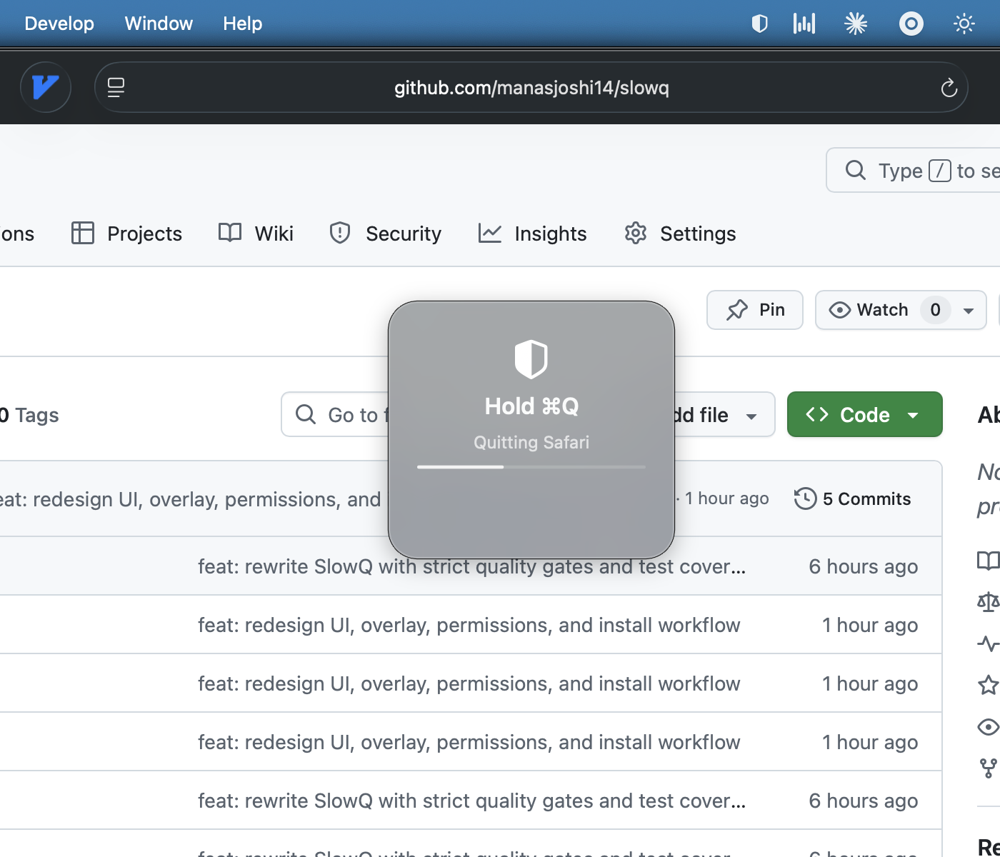
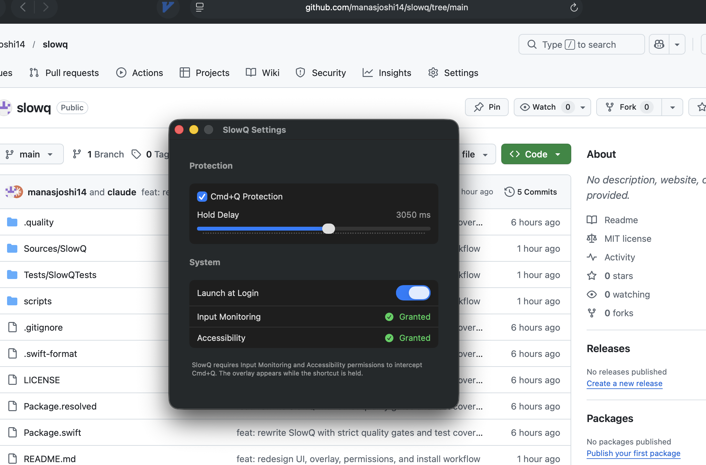
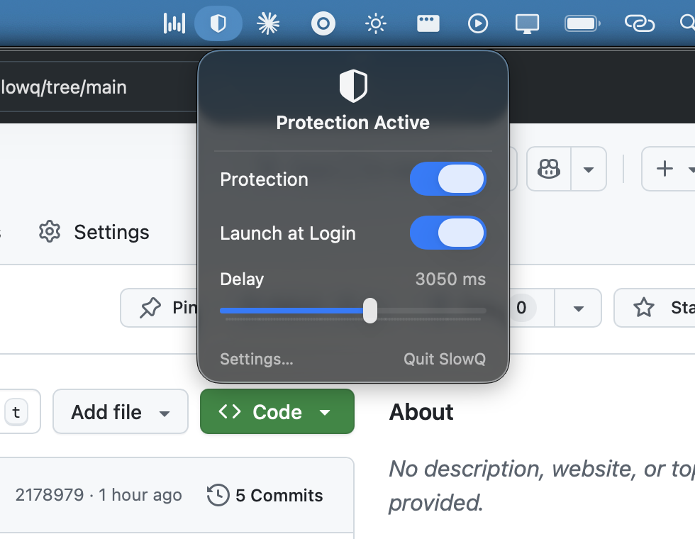

# SlowQ

SlowQ is a native macOS menu bar app that prevents accidental app quits by requiring users to **hold `Cmd+Q`** for a configurable delay.

## Acknowledgement

SlowQ is derived from [SlowQuitApps](https://github.com/dteoh/SlowQuitApps) by dteoh — a complete rewrite in Swift with a new UI, overlay design, and simplified feature set tailored to my use case.

This rewrite was built collaboratively with OpenAI Codex.

## Features (Current Scope)

- Menu bar utility (`LSUIElement`) with a native popover-style window
- Global `Cmd+Q` interception using Quartz event tap
- Hold-to-quit delay slider (`500ms` to `5000ms`, default `1000ms`)
- Centered hold overlay shown while `Cmd+Q` is held
- Launch at Login toggle
- Settings window with permission controls and runtime diagnostics
- No app include/exclude rules (intentionally out of scope)

## Screenshots

### Cmd+Q Hold Overlay

Cmd+Q hold overlay shown while quit protection is active.



### Settings Window

Settings window with protection, delay slider, and permission status.



### Menu Bar Popover

Menu bar popover with quick toggles and delay control.



## Requirements

- macOS 13+
- Swift 6.2 toolchain
- Input Monitoring permission (`ListenEvent`) for key interception
- Accessibility permission may also be required on some macOS versions/configurations

## Quick Start

### Run from source

```bash
swift run SlowQ
```

### Install local app bundle

```bash
./scripts/install-local.sh
```

This builds a release bundle, installs to `/Applications/SlowQ.app`, and launches it.

## Permissions Setup

After launch:

1. Open SlowQ menu.
2. Click `Open Settings...`.
3. Click `Request Permission`.
4. Enable SlowQ in macOS privacy settings (Input Monitoring, and Accessibility if needed).

If protection still does not activate, reinstall:

```bash
./scripts/install-local.sh
```

## Developer Workflow

### Tests

```bash
swift test
```

### Lint

```bash
./scripts/lint.sh
```

### Format

```bash
./scripts/format.sh
```

### Full quality gate

```bash
./scripts/check.sh
```

`scripts/check.sh` enforces:

- strict `swift-format` lint
- warnings-as-errors for build and tests
- coverage threshold from `.quality/coverage_min.txt` (currently `50.0%`)

## Project Structure

- `Sources/SlowQ/Interception`: global key interception and hold-to-quit engine
- `Sources/SlowQ/Overlay`: quit-progress overlay window/presentation
- `Sources/SlowQ/UI`: menu and settings SwiftUI views
- `Sources/SlowQ/Permissions`: Input Monitoring / Accessibility permission abstraction
- `Sources/SlowQ/Settings`: persisted user settings
- `Tests/SlowQTests`: coordinator, permission service, and interception tests

## Persisted Settings Keys

SlowQ stores settings in `UserDefaults`:

- `io.github.manas.SlowQ.delayMs`
- `io.github.manas.SlowQ.isProtectionEnabled`
- `io.github.manas.SlowQ.launchAtLogin`

## Notes

- This rewrite does not migrate settings from the original SlowQuitApps app.
- Current repo is focused on local build/install workflows; release notarization and distribution are not yet configured.
- License: [GPL v2](LICENSE) (derived from [SlowQuitApps](https://github.com/dteoh/SlowQuitApps))
